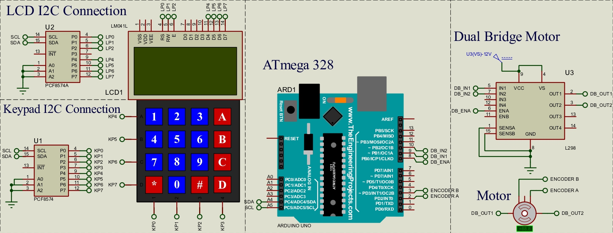

# Motor Speed Control System with PI Controller

A Project to control a DC motor Speed using ATMega328

## Overview

This project implements a motor control system using a Proportional-Integral (PI) controller. The system includes a keypad for user input and an LCD display for output. The motor control system is designed to operate a motor based on a reference velocity set by the user.

## Components

- ATMega328 -> Arduíno Uno
- DC Motor -> JGA25-370
- Encoder for the motor -> JGA25-370
- dual H-bridge motor driver -> L298N Module
- Keypad with I2C interface -> HW-400
- LCD display with I2C interface -> LM041L

## Operation
1. Press '1' to turn the motor on.
2. Press '2' to turn the motor off.
3. Press 'A' to increase the reference velocity.
4. Press 'B' to decrease the reference velocity.

The LCD displays the motor status, current velocity, and the reference velocity. The motor velocity is controlled using the PI controller, adjusting the motor's speed based on the difference between the actual velocity and the reference velocity.

## Project Specifications
- Pulses per revolution: 4 * 11 * 45 (4 INTs per encoder pulse, 11 encoder pulses per revolution, 45 gearbox ratio)
- Maximum speed: 2.0 revolutions per second
- Minimum speed: -2.0 revolutions per second
- Speed step: 0.2 revolutions per second

## PI Controller Equation
$$G(z) = \frac{B0 \cdot (z - B1)}{(z - 1)}$$
$$Voltage_{k} = Voltage_{k-1} + B0 \cdot Error_k + B1 \cdot Error_{k-1}$$

## Library Dependencies
- Keypad_I2C.h
- Wire.h
- LiquidCrystal_I2C.h

## Notes
- The motor direction is determined based on the encoder inputs.
- The PI controller is updated at a frequency of 10 kHz.
- The system uses external interrupts to capture motor encoder pulses.
- Motor speed and controller output are displayed on the LCD.
- The code assumes a clock speed of 16 MHz.

## License

This project is open source and is licensed under the MIT License.

## Credits

- Author: Alailton Alves
- Email: alailtonjunior@ufu.br

